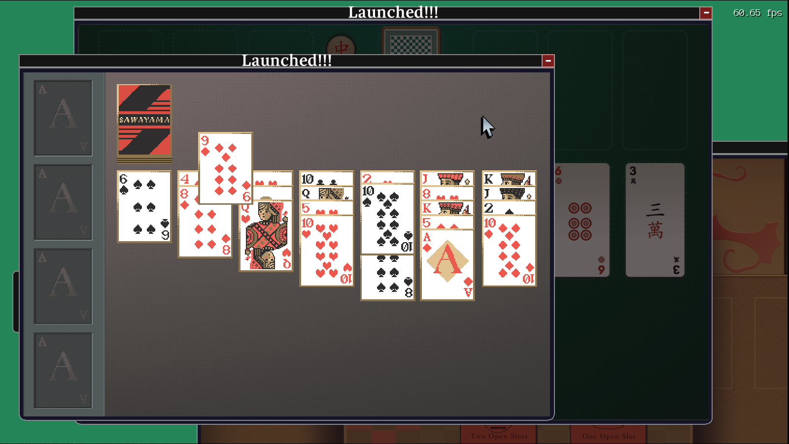
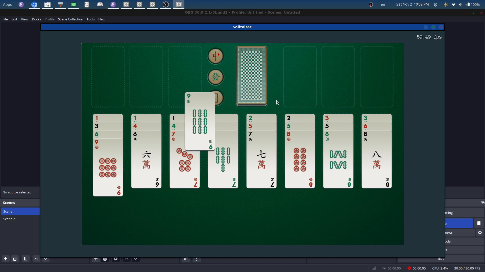

# Solitaire game - old HackBoston forked

This repository contains the source code for the a solitaire game collection that emulates a fictional operating system. My goal of this project is to put the immediate mode widget UI library into real test and to create good looking games.

It is still in active development, although the source code presented in this repository might be a little bit out-of-sync with my current one. Mainly because I use subversion instead of git. 

Anyways, the collection rips off several solitaire games from Zachtronics' design of his solitaire games, but since his game is not open-sourced, I decided to implement them on my own. Well in my version, you have the ability to jump back to the previous playing state and seed that you left off when turning off the game, and you also have the ability to undo and redo using serialization.

For the assets, since I bought the Zachtronics collection, there were some texture files in proprietary format that Zach used, but I decided to reverse engineered it and was able to extraced the raw data for the bitmaps. He didn't convert audio files into a different format so that was easy for me. Thanks to this, I realize that I should be converting my assets to compressed formats and package them into different files moving forward, one is to obfuscate my actual assets, two is to make the load faster for actual shipping builds. 

For the variants of Solitaire, 5 of the 6 variants is from the Zachtronics Collection, and the last one, Birds of a Feather, is taken from professor Todd Neller.

Here are some images of the game, be cautious, these images range from pre-Alpha to Alpha. That means I should be updating it soon.

You have reached the extra section of this project, this is the demo of wobbly window (one of the eye candy features of this fictional OS) at its very primitive stage:

